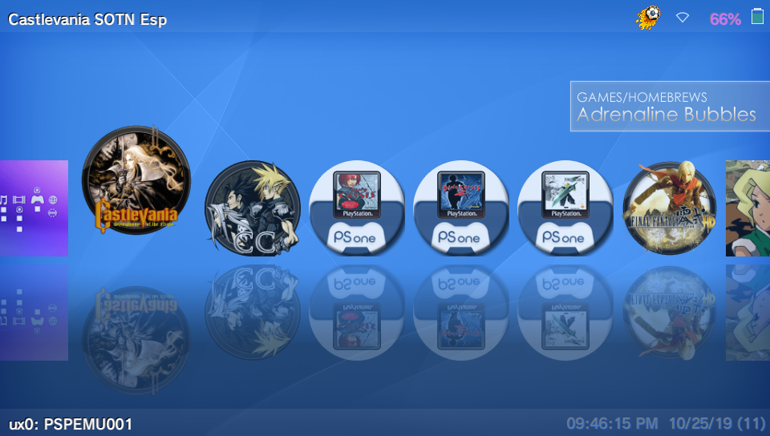
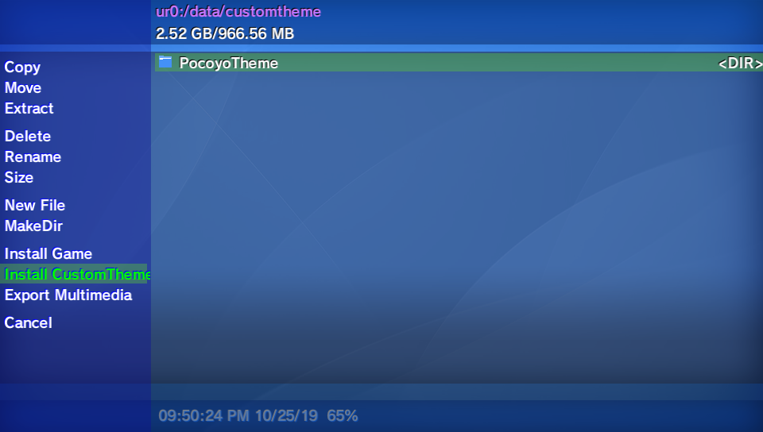
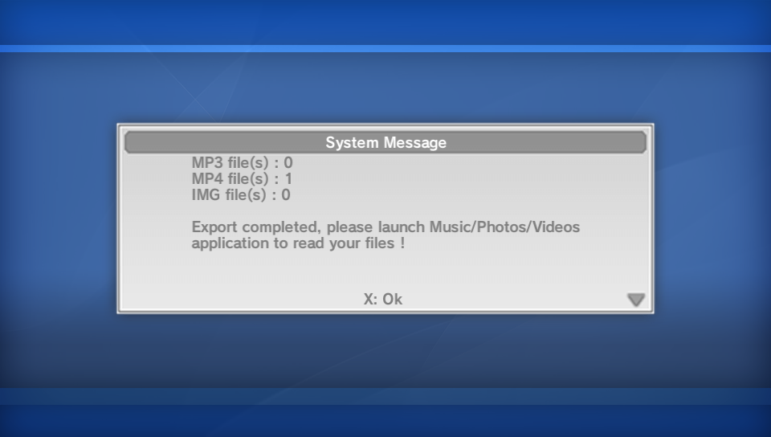
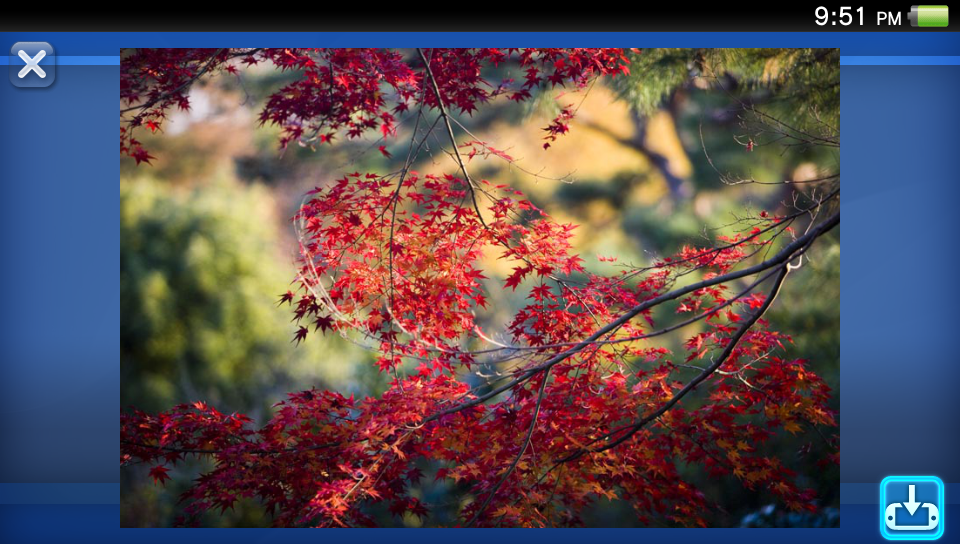
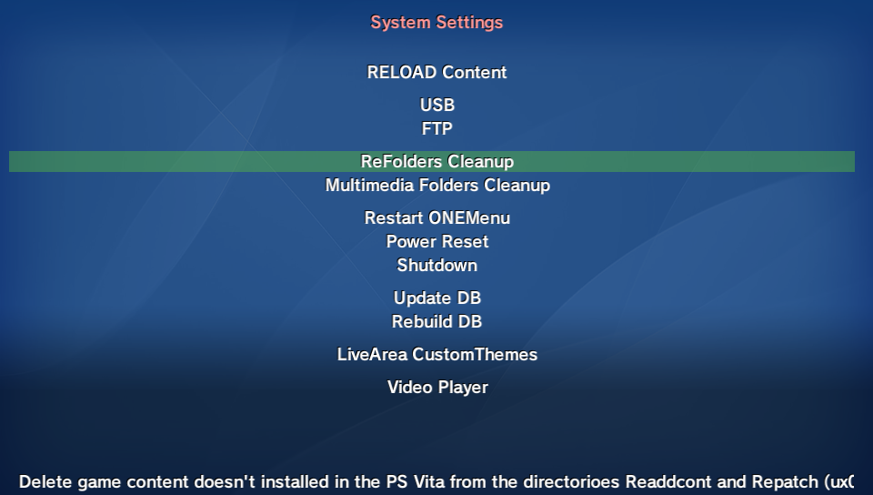
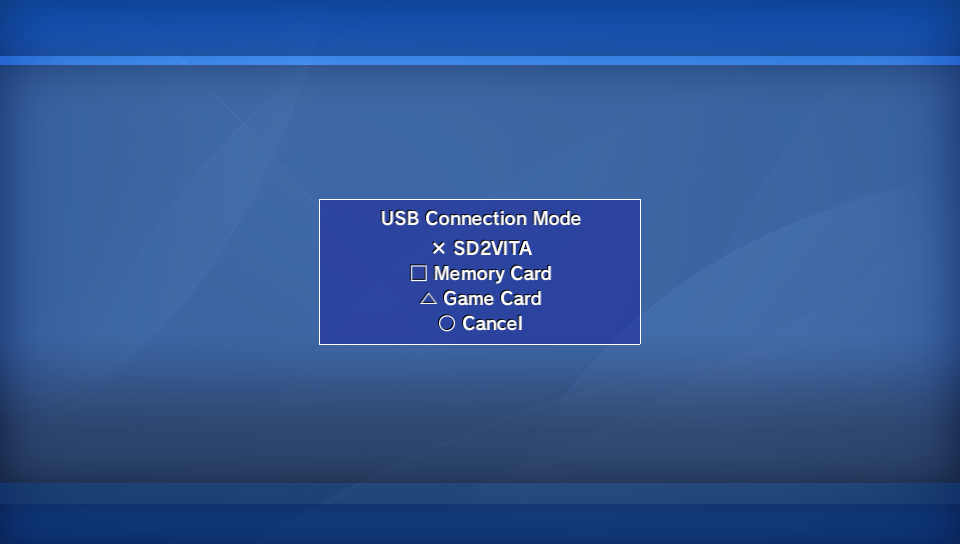
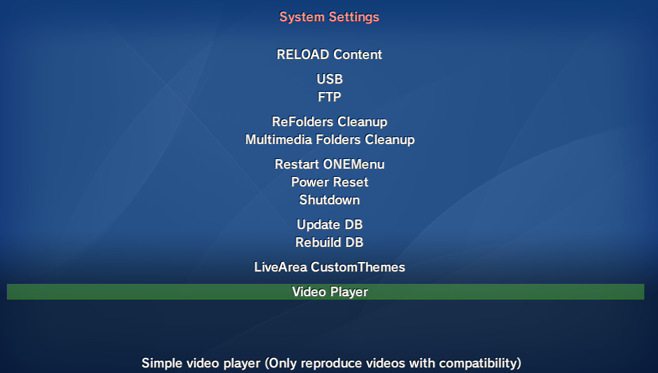
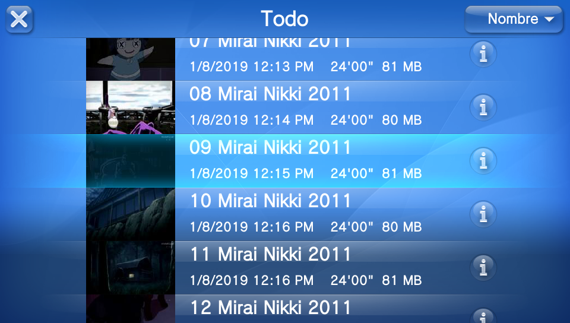

# ONEMenu for PSVita

**OneMenu for PSVita** is a simple to use UI which separates the installed games and apps into categories. 

- Onemenu comes with a built in File Explorer.
- Installing/uninstalling apps/games, vpks (Including Nonpdrm content, you have to install the plugin Nonpdrm).
- Move the selected homebrew to diferent partition (ux0-ur0-uma0).
- Connect via ftp or usb to the pc (Memory Card, SD2Vita or GameCard).
- Extract zip/rar files.
- Edit the title show in the Bubbles in the LiveArea. 
- Update the database without lose the IconLayout, very usefull to install PSM games (You have to install the plugins nopsdrm and nonpdrm).
- Shrink Game: Allows to free up some space by eliminating some game folders/files such as: Game Manual, and some folders/files from ux0:app/(GAMEID) since those folders/files are also at ux0:patch/(GAMEID) (ux0:Repatch/(GAMEID)). 
- Install CustomThemes in ux0, ur0 and uma0.
- Delete game content doesn't installed in the PS Vita from the directorioes Readdcont and Repatch (ux0,uma0,imc0,xmc0)
- Functions to export Multimedia files (images jpg,png, music mp3, videos mp4).
- restart, shutdown, rebuild db.

Shrink Game is based on TheRadziu's Tutorial https://github.com/TheRadziu/NoNpDRM-modding/wiki#saving-memory-space-while-using-mods
* NOTE: Be very careful after using this option, because if the folders/files get deleted from ux0:patch/(GAMEID) or ux0:rePatch/(GAMEID) the game will stop booting cause there won't be any folders/files left at ux0:app/(GAMEID)

### Changelog 3.15 ###
- Added support for firmware 3.71/3.72. 
- Added Refresh Content for PSM games. Thanks to Kuromesan 
- New option to create .zip. 

### Changelog 3.14 ###
- Added support for firmware 3.71/3.72. 
- Added a simple video player (Only plays compatible videos with the PSVita). 
- In the game screen (Bubbles) you have to press the square button to access to system aplications. 
- Now, to access to the system options of ONEMenu you have to press the start buttom. 
- New option "Delete empty directories on multimedia directories" in the system options of ONEMenu. 
- Bug fixes and improvements in the code. 

## ONEMenu icons ##

**UP/Down:** Category change (5 categories available: Vita/Hb games, PSM Games, PSP/Hbs Games, PS1 Games, Adrenaline Bubbles). 
**L/R:** Fast scrolling. 
**Square:** Opens system apps. 

**Triangle:** Open Submenus 

- Uninstall Bubbles
- Shrink Game (Only for PSVita games)
- Edit Bubble Title (Don't edit PSM games and PSP/PS1 official games)
- Move App to ux0-ur0-uma0 (Only for Homebrews)
- Sort Category bi Title, Id and Region.

## System Settings (1) ##

**Start:**

- Reload Content: Allows to install games in ux0:app (Thanks the plugin Nonpdrm from TheFloW)
- Shows PICs: Show every bubble pic
- Style: Change the style of the icons on ONEMenu
	Up: Clasic Menu style with mirrored icons and the category slides above the icons list.
	Down: Simple menu similar to PS4 with the category slide below, this option does not have the icons reflections.
- Themes OneMenu: download/install/change Themes for ONEMenu

- Enable AutoUpdate: Enable/Disable the AutoUpdate feature to allow or block future ONEMenu updates.

**Select:** File Explorer

## ONEMenu File Explorer ##

**L/R:** Change partition. 
**Triangle:** Open Submenus 

- Copy
- Move
- Extract (zips and rars).

- Delete
- Rename
- Size    (folder/file size)

- NewFile
- MakeDir

- Install games as vpk or folder 

- Install CustomThemes for LiveArea 

- Export multimedia files (mp4, mp3, png, jpg). 

## System Settings (2) ##

**Start:**

- Reload Content: Allows to install games in ux0:app (Thanks the plugin Nonpdrm from TheFloW) 
- USB connection 

- FTP
- ReFolder Cleanup: Delete game content doesn't installed in the PS Vita from the directorioes Readdcont and Repatch (ux0,uma0,imc0,xmc0).
- Multimedia Folders Cleanup: Delete empty directories on multimedia directories: "ux0:music/", "ux0:picture/ALL/", "ux0:picture/CAMERA/", "ux0:picture/SCREENSHOT/", "ux0:video/".

- Restart ONEMenu
- Power Reset
- Shutdown

- Update Database (app.db)
- Rebuild Database (app.db)

- LiveArea CustomThemes: You can uninstall CustomThemes, not official themes.
- Video Player: Only plays mp4 videos compatibles with PSVita.

# Credits
*Xerpi* for vita2d. 
*TheFloW* Pkg installer & USB Modules & User/Kernel Modules. 
*Yifan-lu, XYZ and Davee* and every coder and dev contributing to Vitasdk. 
*Team Molecule* for Henkaku. 
*WZ-JK* For Graphics. 
*Yizhi gai* For the text editor. 
*Kuromesan* for Refresh PSM games
Translate: 
*([Z3R0](https://twitter.com/Z3R0N3__)).* 
Testers: 
*([BaltazaR4](https://twitter.com/baltazarregala4)).* 
*([thehero_](https://twitter.com/TheheroGAC)).* 
*([Applelo1](https://twitter.com/Applelo1)).* 
*([Tuto Pro Play](https://twitter.com/Tuto_Pro_Play)).* 
*([TheRadziu](https://twitter.com/AluProductions)).* 

