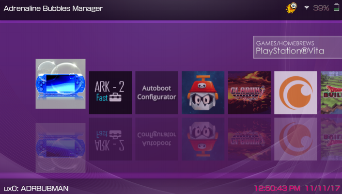
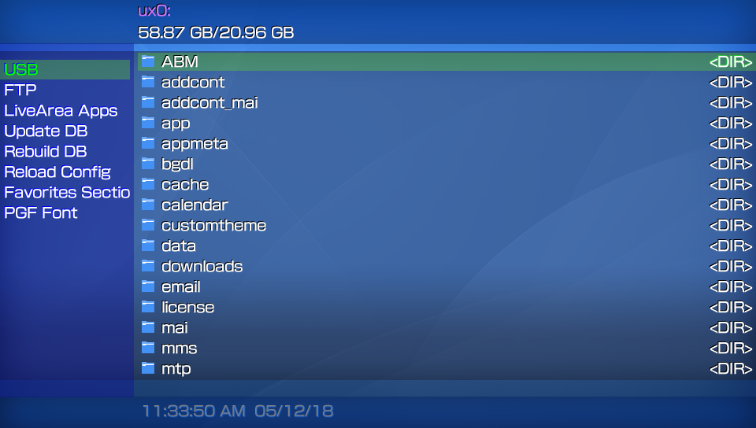
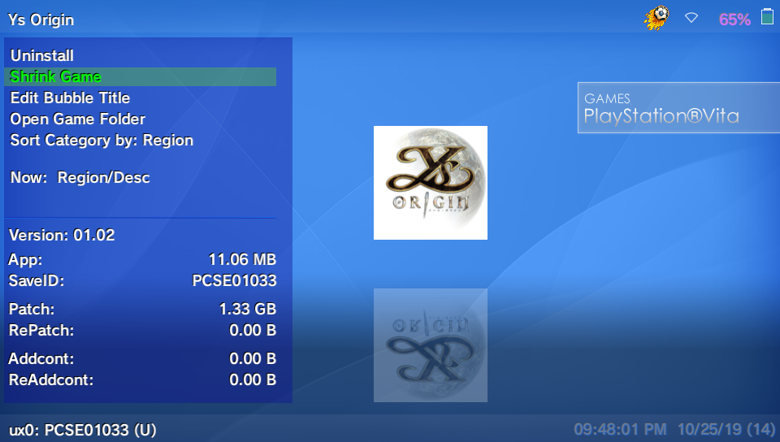
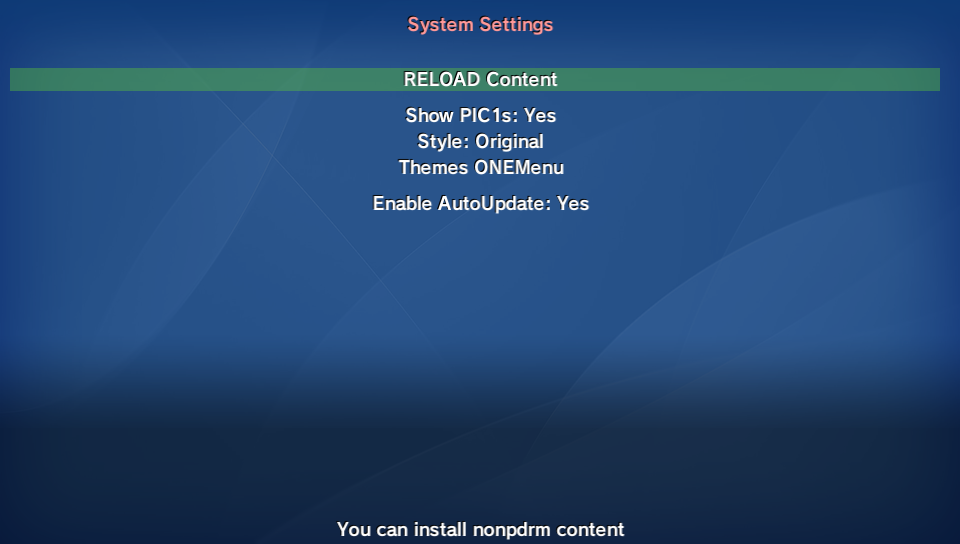
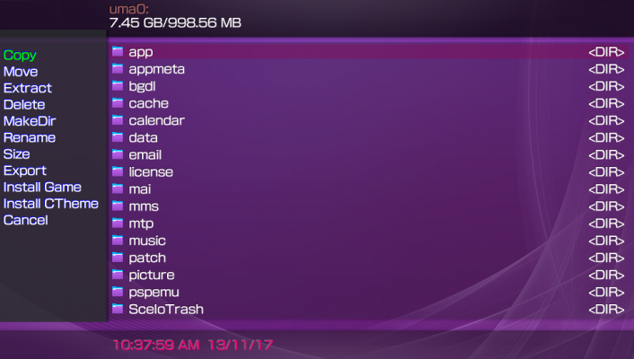
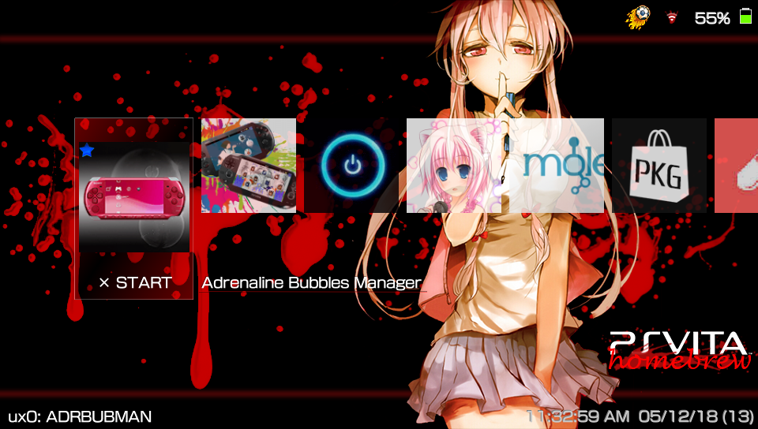

# ONEMenu for PSVita

App Manager Plus has evolved to Onemenu for psvita! so, App manager Plus will no longer be updated.

**OneMenu for PSVita** is a simple to use UI which separates the installed games and apps into categories... 
Onemenu comes with a built in file explorer which has many advanced features such as installing/uninstalling apps/games, move the selected app/game to diferent partition (ux0-ur0-uma0) connect via ftp or usb to the pc, restart, shutdown, rebuild db...

# Controls:

### Changelog 2.01 ###
- Fix and more Fix errors. 

### Changelog 2.00 ###
- Icons and games list loading time reduced everytime Onemenu is started. 
- New categorie "Favorites". 
- "Favorites" section at advanced submenu. 
- Categorie PS Vita games/homebrews got separated into "PSVita" and "Homebrews Vita". 
- PSP and PSX content unified into one categorie : "Retro Games". 
- Lines added to english_ux.txt ...Dont forget to update your translations. 
- Now your avatar icon gets downloaded to ux0:data/onemenu so it can get loaded offline. 

- Images PSP.PNG y PS1.PNG got eliminated and instead the image RETRO.PNG has been added for the categorie PS Retro games (for PSP and PS1 games). 
- Added the image HBVITA.PNG for Homebrews PSVita categorie. 

- Added two lines on the theme ini file : 
	COUNTCOLOR to print the folder/file count in the file explorer. 
	CBACKSBARCOLOR to draw the bars in the callbacks section. 

### Changelog 1.01 ###
Please update your translations...Two new lines were added: 
*PGF Font* 
*PVF Font* 

- [FIX] Incorrect display of LiveArea app names. 
- [FIX] PS Button lock when using FTP and USB mode. 
- [FIX] Some errors in the internal code. 
- [FIX] Standard format month/day/year. 
- [NEW] Support to change the type of font (PGF<->PVF) in advanced options. 
- 3 added shortcuts: 
- L + R + Up: Restart ONEMenu. 
- L + R + Down: Restart PSvita. 
- L + R + Square: Shutdown PSvita. 

**ONEMenu icons list:**

**UP/Down:** 
Category change (5 categories available: Vita/Hb games, PSM Games, PSP/Hbs Games, PS1 Games, Adrenaline Bubbles). 
**L/R:** 
Fast scrolling. 
**Start:** 
Opens a submenu with a list of system apps. 
**Triangle:** 
Open Submenu: 

	Uninstall		Allows to uninstall selected app/game.
	Remove manual		Allows to eliminate the game/app manual.
	Switch app		Allows to move the selected app/game between the 3 available partitions (ux0-ur0-uma0).

**Slides**					2 options:. 

	Up: Clasic Menu style with mirrored icons and the category slides above the icons list.
	Down: Simple menu similar to PS4 with the category slide below, this option does not have the icons reflections.

**Show PICS**				Allows to show the selected game PIC in the submenu. 

**Explorer Files**

**Triangle:**

	Opens SubMenu1 with basic functions as Copy, Move, Install games as vpk or folder, Install CustomThemes, etc...

**Start:**

	Opens SubMenu2 with advanced functions as FTP and USB connection, Restart or Shutdown the PSVita, Update and/or Rebuild Database (app.db), Option for vpks/isos/cso Search, Change Available Themes for ONEMenu and Uninstall CustomThemes.

### NOTE: 
When a CustomTheme is installed the corresponding folder and files are moved to ux0:data/customtheme and for uninstalling any of these CustomThemes you'll be given the option to eliminate the folder and files of the CustomTheme, if you choose not to eliminate them, then the resources of said CustomTheme will be moved to the path ux0:data/uninstall_customtheme for reinstalling in the futured. 

The Themes for ONEMenu have to be placed in the path ux0:data/ONEMENU/themes following mostly the same instructions as for AppManager Themes. 

# Theme Personalization

**Themes for ONEMenu**

++ Create a new folder with the theme name and place the next resources inside:. 

**font.ttf**        Font ttf for your Theme (Optional). 

**back.png**        Background image for your icons (960*544). 

**icodef.png**      Default icon to blit instead of the app/game icon0 when the original icon0 can't be loaded (100*100). 

**buttons1.png**    Image Sprites (160*20). 

  1. position 0				Cross button

  1. position 1				Triangle button

  1. position 2				Square button

  1. position 3				Circle button

  1. position 4				Plugin icon for games with plugins enabled to it's GAMEID in the config.txt

  1. position 5				Clon icon for cloned psp bubbles.

  1. position 6				For battery in use.

  1. position 7				For battery charging.

  1. position 8				For Favorites.

**buttons2.png**    Image Sprites (120*20)
  
**wifi.png**        Image Sprites (132*22)

**cover.png**       Image for Song Cover in Music section (369x369)

**music.png**       Image for Music section (960*544)

**ftp.png**         Background Image for FTP port message (960*544)

**list.png**        Image for ExplorerFiles and vpk/iso/cso search results found on memory card (960*544)

**menu.png**        Image for blitting the options submenu (167*443)

**themesmanager.png**		Background Image for ONEMenu theme selection section (960*544)

**preview.png**     Your image preview for your theme for ONEMenu (391*219)

**icons.png**       Sprites (112x16) must follow next order:

  1. position 0			    Icon to blit for general files

  1. position 1				Icon to blit for folders

  1. position 2				Icon to blit for: pbp, prx, bin, suprx, skprx files

  1. position 3				Icon to blit for: png, gif, jpg, bmp image files

  1. position 4				Icon to blit for: mp3, s3m, wav, at3, ogg sound files

  1. position 5				Icon to blit for: vpk, rar, zip files

  1. position 6				Icon to blit for: iso, cso, dax files

*Label Categories*

**PSVITA.png**		PSVita Games (250*66). 

**HBVITA.png**		Homebrews Vita (250*66). 

**PSM.png**		PSM Games (250*66). 

**RETRO.png**		PSP & PS1 Games (250*66). 

**ADRBB.png**		Adrenaline Bubbles Games (250*66). 

**FAV.png**		Favorite Games (250*66). 

# Create a ini file

**theme.ini**

This .ini file stores the text printing colors according to file extension. 
*Change only the Hex-Dec part for the desired color. (ABGR format) 

TITLE = "Name of your theme". 
AUTHOR = "Name of Author". 

*# Text and background color.* 
TXTCOLOR		= 0xFFFFFFFF 
TXTBKGCOLOR		= 0x64000000

*#Header color.* 
TITLECOLOR      = 0xFF9999FF

*#Submenu color bar on selected icon.* 
BARCOLOR        = 0x64330066

*#Path text color (File Explorer).* 
PATHCOLOR       = 0xA09999FF

*#Date and time indicator text color.* 
DATETIMECOLOR   = 0xFF7300E6

*#Folder/File count in the file explorer.* 
COUNTCOLOR	= 0XFF0000FF

*#Draw the bars in the callbacks section.* 
CBACKSBARCOLOR	= 0x64FFFFFF

#File type text color for File Explorer.* 
SELCOLOR        = 0x64530689 
SFOCOLOR        = 0XFFFF07FF 
BINCOLOR        = 0XFF0041C3 
MUSICCOLOR      = 0xFFFFFF00 
IMAGECOLOR      = 0xFF00FF00 
ARCHIVECOLOR    = 0xFFFF00CC 
MARKEDCOLOR     = 0x2AFF00FF 
FTPCOLOR		= 0xFFFF66FF 

*#Battery percentage text color.* 
PERCENTCOLOR	= 0x6426004D

*#Battery status indicator bar color.* 
BATTERYCOLOR	= 0x6453CE43 
LOWBATTERYCOLOR	= 0xFF0000B3 

*#Rectangle and gradient color for selected icon (PS4 Theme).* 
GRADRECTCOLOR	= 0x64330066 
GRADSHADOWCOLOR = 0xC8FFFFFF 

*Change only the Hex-Dec part for the desired color. (ABGR format) 
Recommended website: ([Colors Hex](https://www.w3schools.com/colors/colors_hexadecimal.asp)). 

ONEMenu Themes must be placed in the next path:. 
ux0:data/ONEMENU/themes/yournameTheme

# Language

You can translate the file ux0:data/ONEMENU/english_us.txt and rename it to corresponding language:. 
JAPANESE.txt 
ENGLISH_US.txt 
FRENCH.txt 
SPANISH.txt 
GERMAN.txt 
ITALIAN.txt 
DUTCH.txt 
PORTUGUESE.txt 
RUSSIAN.txt 
KOREAN.txt 
CHINESE_T.txt 
CHINESE_S.txt 
FINNISH.txt 
SWEDISH.txt 
DANISH.txt 
NORWEGIAN.txt 
POLISH.txt 
PORTUGUESE_BR.txt 
ENGLISH_GB.txt 
TURKISH.txt 

Then you have to place at the following path:
ux0:data/ONEMenu/lang/

*Remember to translate only the quoted words from english_us.txt.

# Credits
*Xerpi* for vita2d. 
*TheFloW* Pkg installer & USB Modules. 
*Yifan-lu, XYZ and Davee* and every coder and dev contributing to Vitasdk. 
*Team Molecule* for Henkaku. 
*WZ-JK* For Graphics. 
Testers: 
*([thehero_](https://twitter.com/TheheroGAC)).* 
*([Applelo1](https://twitter.com/Applelo1)).* 
*([Tuto Pro Play](https://twitter.com/Tuto_Pro_Play)).* 

